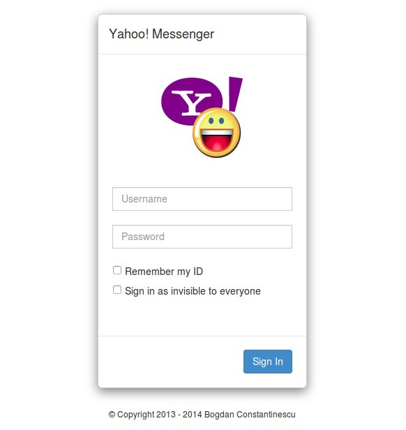
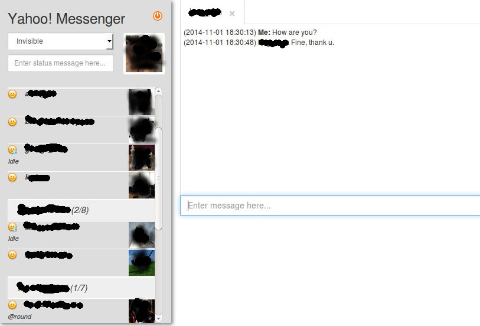

Yahoo Messenger browser based chat
======================================
####This is a simplistic browser based Yahoo Messenger chat that uses [bogcon/yahoo-messenger-api](https://github.com/bogcon/yahoo-messenger-api) library.  


Installation/Configuration
--------------------------
1. Download source files
    - Using Git  
 ```sh
 git clone https://github.com/bogcon/webym.git
 ```
    - Direct download of *.zip* archive from [here](https://github.com/bogcon/webym/archive/master.zip)  
2. Install depedencies using [Composer](https://getcomposer.org/)  
Then you can run the Composer install/update command from the root directory of the project (where `composer.json` file resides)
 ```sh
 # download composer (skip the next command if you already have composer)
 $ curl -sS https://getcomposer.org/installer | php
 
 # install dependencies
 $ php composer.phar install
 $ php composer.phar update
 ```
3. Copy `webym/includes/config.local.php.dist` to `webym/includes/config.local.php` and edit the last one with the API key and API secret obtained from [Yahoo developer](https://developer.yahoo.com/) account after creating an application.

4. Configure a (virtual) host for the project  
##### Example of Local Apache Web Server Configuration
You now need to create an Apache virtual host for the application and edit your hosts file so that `http://webym.dev` will serve `index.php` from the `webym/public` directory.  

    Setting up the virtual host is usually done within `httpd.conf` or `extra/httpd-vhosts.conf`. If you are using `httpd-vhosts.conf`, ensure that this file is included by your main `httpd.conf` file.  
Some Linux distributions (ex: Ubuntu) package Apache so that configuration files are stored in `/etc/apache2` and create one file per virtual host inside folder `/etc/apache2/sites-enabled`. In this case, you would place the virtual host block below into the file `/etc/apache2/sites-enabled/webym.dev.conf`, also you should copy the file or create a symlink into `/etc/apache2/sites-available/webym.dev.conf` (*ln -s /etc/apache2/sites-enabled/webym.dev.conf /etc/apache2/sites-available/webym.dev.conf*)  
    
    Ensure that `NameVirtualHost` is defined and set to `*:80` or similar, and then define a virtual host along these lines:  

        <VirtualHost *:80>
                ServerName webym.dev
                ServerAlias www.webym.dev
                DocumentRoot /path/to/webym/public
                <Directory /path/to/webym/public>
                    DirectoryIndex index.php
                    AllowOverride All
                    Order allow,deny
                    Allow from all
                </Directory>
        </VirtualHost>  

    Make sure that you add the following line to your `/etc/hosts` or `C:\Windows\System32\drivers\etc\hosts` file so that `webym.dev` is mapped to `127.0.0.1`.  
    
        127.0.0.1   webym.dev www.webym.dev  
    After restarting apache, the website can then be accessed using `http://webym.dev` or `http://www.webym.dev`.

License
--------------------
`webym` is released under the `New BSD License` which is the 3-clause BSD license.  
You can find a copy of this license in [LICENSE.txt](LICENSE.txt).

Screenshots
-------------------
  
  
